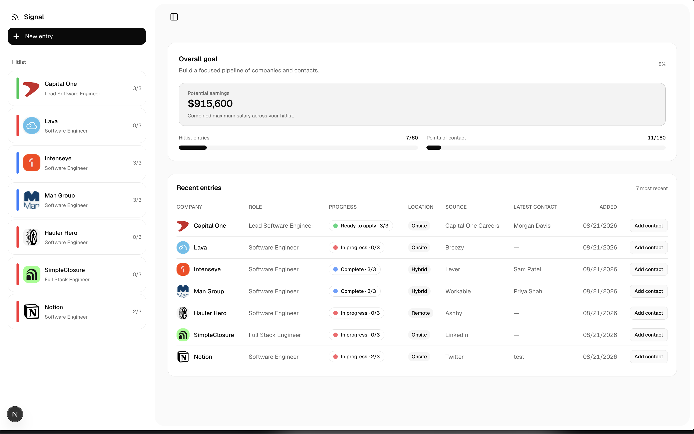

## Bugs

- Currently, you can click submit button without text in the input form: `[CONVEX M(submissions:submit)] [Request ID: 76ac3ffd9b70f5e5] Server Error Called by client` – FIXED

- Currently receiving an error when attempting to create long form notes, ~600 words, `[CONVEX M(notes:create)] [Request ID: ad5dfe3ad8fe20f8] Server Error Called by client`. Maybe add char limit to textarea and char limit counter.

- Typo on quick checks "cardsfrom" – **FIXED**

- Class 23, Intro to GitHub resource link is broken. It's been a while since I've done it but this may be the intended destination `https://learn.microsoft.com/en-us/training/modules/introduction-to-github/`

- Class 35, Incomplete timestamps, "Break" is the final timestamp starting at 57:35, when there's ~2hrs remaining in the class.

- Class 37/38, missing resource link to Mayanwolfe's walkthrough installing node.js (https://www.youtube.com/watch?v=VOfqO4-RLd4)

- Class 41, check-in link is the same tweet as Class 42. Currently it is (https://x.com/leonnoel/status/1534286728218804224?s=20) (Jun 7,2022). The following link is from Class 39 per communitytaught.org (https://x.com/leonnoel/status/1532474747346247681) (Jun 2, 2022) which lines up to Class 41 on LMS.

- Class 41, HW section – may want to include other options for where to host API for free.

- Class 45 should have check-in 1 and check-in 2 (https://x.com/leonnoel/status/1557117071565000704) (https://x.com/leonnoel/status/1557841864111230976) – per communitytaught.org

- Class 46 should have check-in 1 and check-in 2 (https://x.com/leonnoel/status/1559654124253196288) (https://x.com/leonnoel/status/1560378673957482496) – per communitytaught.org

- Class 49 should have 3 check-ins, (https://x.com/leonnoel/status/1564727546385555456) (https://x.com/leonnoel/status/1565452220727906309) (https://x.com/leonnoel/status/1567264659186814976) – per communitytaught.org

- class 50 should have 3 check-ins, per communitytaught.org (https://x.com/leonnoel/status/1567988894712627201) (https://x.com/leonnoel/status/1569467339028201474) (https://x.com/leonnoel/status/1570527569166086144)

- Class 51 (backend crash course) timestamps stop at 1:05:01

- Class 52, submission for HW field is unncessary, all HW is optional and is watching videos.

- Class 54, missing check-in link #2 (https://x.com/huntoberTweets/status/1578075112225415169) – per communitytaught.org

- Class 55, check-in link is broken and missing other two (https://x.com/mayanwolfe/status/1580231634271768576) (https://x.com/BlawblawLaw/status/1582051606614355974) – per communitytaught.org

- Class 56, video player is broken (tested in firefox and chrome environments) (desktop & mobile)

- Class 57, video player is broken (tested in firefox and chrome environments) (desktop & mobile)

- Class 59, video player is broken (tested in firefox and chrome environments) (desktop & mobile)

- Class 60, video player is broken (tested in firefox and chrome environments) (desktop & mobile)

## General Notes & Suggestions

- Could implement a hitlisting platform into the LMS (though this strays from the goal of creating the best learning tool closer to being an one stop shop for the 100devs course)

    - here's a SS of my personal tool:

- Quiz sections for Checking Understanding – may want to change "Last attempt" to "Previous attempt" to avoid possible confusion on whether or not it's a user's last attempt at the quiz versus what they previously scored on the quiz.

- After submitting HW, the div could collapse and show a completed badge, check, etc

- Starting at Class 9, networking night, maybe an in-house tool or tracker can be implemented to the platform to keep all things 100Devs in one place (although this sort of feature strays away from the core idea of the LMS – which is being the best learning platform)

- For classes where all HW is optional, ex: Class 7, the form for submitting HW is collapsed or hidden by default, and only expanded or revealed if user chooses to submit additional work. (UX QoL)

- Sonner toasts can use addressing, inconsistent use of descriptions. Ex: update toast to include description on success for check you understanding section, marking a class complete, homework submission and update toast format can be addressed, broken into `toast.success("Nice work!", { description: "Your homework has been successfully submitted." })` and `toast.success("Success", { description: "Homework submission updated." })` etc

- Could add an appearance mode toggle while in Lock-in mode? (QoL)

- After first super review, count of classes are thrown off, ex Class 20 description states "Originally streamed as Class 19 of #100Devs (cohort 2)." – if LMS is going to be the primary method for people to complete 100Devs moving forward, may be worth while replacing with more descriptive per class.

- If submitting HW is a requirement to marking a class as complete, classes with only push work (optional tagged) needs to be addressed

